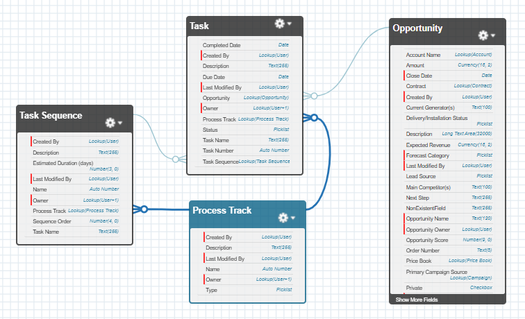

# Task Sequencer for ubitricity

## Entity Relationship Diagram

 

## Overview
A configurable Task Sequencer system in Salesforce that automatically creates and manages sequential tasks on Opportunities based on operational processes selected by users. This solution helps ubitricity manage complex workflows for EV charging infrastructure deployment by tracking sequential tasks automatically.

## Business Problem
At ubitricity, the Operational team needs a system to automatically track sequential tasks on Opportunities based on different operational processes (site surveys, installations, grid connections, etc.).

**Current challenges:**
- Missed steps in critical processes
- Lack of visibility on progress
- Inconsistent execution across teams
- Difficulty onboarding new team members

## Solution Architecture

### Data Model
1. **Process_Track__c** - Defines operational processes
2. **Task_Sequence__c** - Defines task sequences for each process
3. **Task__c** - Custom task object that tracks individual task instances
4. **Opportunity** - Enhanced with Process__c picklist field

### Key Features
- **Configurable Processes**: Administrators can define unlimited processes and task sequences
- **Automatic Task Creation**: Tasks are created automatically when processes are selected
- **Sequential Progression**: Each completed task automatically creates the next task in sequence
- **Business Day Calculation**: Due dates exclude weekends
- **Security Enforcement**: Full CRUD/FLS security compliance
- **Bulk Operations**: Handles large data volumes efficiently
- **Error Handling**: Comprehensive error handling and notifications

## Setup Instructions

### 1. Post-Deployment Configuration

#### Enable Path Settings
1. Navigate to **Setup** → **Path Settings**
2. Enable Path for your org
3. Create a Path for Opportunity object named "Process"

#### Configure Custom App
1. Navigate to **Setup** → **App Manager**
2. Find the "ubi" app and click **Edit**
3. Add appropriate user profiles in the **User Profiles** section
4. Save the configuration

#### Assign Permission Sets
1. Navigate to **Setup** → **Users** → **Permission Sets**
2. Find "ubi_Task_Sequencer" permission set
3. Assign to relevant users

### 2. Initial Configuration

#### Step 1: Define Process Tracks
1. Navigate to the **Process Tracks** tab
2. Click **New**
3. Enter:
   - **Type**: Must match Opportunity.Process__c picklist values
   - **Description**: Process description

**Example Process Tracks:**
- Type: `Site_Survey`, Description: "Site Survey Process"
- Type: `Installation`, Description: "Installation Process" 
- Type: `Grid_Connection`, Description: "Grid Connection Process"

#### Step 2: Define Task Sequences
1. Navigate to the **Task Sequences** tab
2. Click **New**
3. Enter:
   - **Process Track**: Select the relevant process track
   - **Sequence Order**: Start with 1, increment by 1
   - **Task Name**: Name of the task
   - **Description**: Task description
   - **Estimated Duration**: Number of business days for due date calculation

**Example for Site Survey Process:**
1. Sequence Order: 1, Task Name: "Initial Site Assessment", Estimated Duration: 2
2. Sequence Order: 2, Task Name: "Technical Feasibility Review", Estimated Duration: 3
3. Sequence Order: 3, Task Name: "Stakeholder Coordination", Estimated Duration: 5
4. Sequence Order: 4, Task Name: "Final Survey Report", Estimated Duration: 2

### 3. Usage

#### For End Users:
1. **Select Process on Opportunity**:
   - Open an Opportunity
   - Select a value from the **Process** picklist
   - The first task in the sequence will be automatically created

2. **Complete Tasks**:
   - Navigate to the **Opportunity Tasks** related list
   - Update task status to "Completed"
   - The next task in the sequence will be automatically created
   - Due dates are calculated based on business days (excluding weekends)

3. **Monitor Progress**:
   - View all tasks in the Opportunity Tasks related list
   - Track completion status and due dates

#### For Administrators:
1. **Add New Processes**:
   - Create new Process Track records
   - Define Task Sequence records in order

2. **Modify Existing Processes**:
   - Update Task Sequence records as needed
   - Changes will affect new Opportunities only

3. **Troubleshooting**:
   - Check debug logs for error details
   - Monitor task completion rates

## Automation Details

### Triggers
- **OpportunityTrigger**: Handles process selection and validation
- **TaskTrigger**: Handles task completion and next task creation

### Apex Classes
- **OpportunityTriggerHandler**: Manages Opportunity trigger logic
- **TaskTriggerHandler**: Manages Task trigger logic  
- **TaskSequencerHelper**: Core business logic for task sequencing
- **ErrorHandler**: Centralized error handling and notifications
- **TestDataFactoryClass**: Test data generation

### Key Business Rules

1. **Process Change Validation**:
   - Cannot change Process field if active tasks exist
   - Process can only be changed if all tasks are completed or no tasks exist

2. **Task Sequencing**:
   - Only the first task is created initially
   - Each completion triggers creation of the next sequential task
   - Last task completion doesn't create new tasks

3. **Due Date Calculation**:
   - Based on Estimated Duration from Task Sequence
   - Excludes weekends (Saturday and Sunday)
   - Uses business days only

## Error Handling

The system includes comprehensive error handling:

- **Validation Errors**: Prevent invalid process changes
- **Security Enforcement**: Respects user permissions
- **Graceful Degradation**: Continues processing when individual records fail
- **Error Notifications**: Sends emails to opportunity owners for critical errors
- **Logging**: Detailed debug logs for troubleshooting

## Testing

### Test Coverage
The solution includes test classes with comprehensive code coverage:

- **TaskSequencerHelperTest**: Tests core sequencing logic
- **OpportunityTriggerHandlerTest**: Tests process validation and task creation
- **TaskTriggerHandlerTest**: Tests task completion handling
- **ErrorHandlerTest**: Tests error handling scenarios
